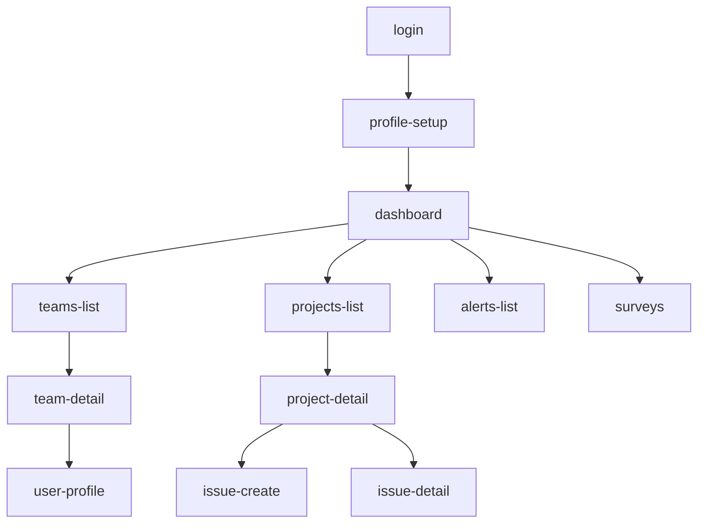

# UI ページ仕様書

AIエージェントが各ページを実装するための個別仕様書です。  
全ページの Source of Truth は [`docs/ui-specification.md`](../ui-specification.md) です。

## ページ一覧

| ファイル | パス | ページ名 | 優先度 |
|---------|------|----------|--------|
| [login.md](login.md) | `/login` | ログイン | P0 |
| [profile-setup.md](profile-setup.md) | `/profile/setup` | プロフィール登録 | P0 |
| [dashboard.md](dashboard.md) | `/` | ダッシュボード | P2 |
| [teams-list.md](teams-list.md) | `/teams` | チーム一覧 | P1 |
| [team-detail.md](team-detail.md) | `/teams/[teamId]` | チーム詳細 | P1 |
| [projects-list.md](projects-list.md) | `/projects` | プロジェクト一覧 | P1 |
| [project-detail.md](project-detail.md) | `/projects/[projectId]` | プロジェクト詳細 | P1 |
| [issue-create.md](issue-create.md) | `/projects/[projectId]/issues/new` | Issue作成 | P1 |
| [issue-detail.md](issue-detail.md) | `/issues/[issueId]` | Issue詳細 | P1 |
| [alerts-list.md](alerts-list.md) | `/alerts` | アラート一覧 | P2 |
| [surveys.md](surveys.md) | `/surveys` | サーベイ | P3 |
| [user-profile.md](user-profile.md) | `/users/[userId]` | プロフィール閲覧 | P3 |

## 依存関係



## 仕様フォーマット

各ファイルは以下のセクションで構成されています（`docs/ui-specification.md` Section 15 準拠）:

1. **Purpose** — ページの目的
2. **Route** — パス
3. **Access Control** — 認証・ロール要件
4. **Layout** — 使用レイアウト
5. **Component Tree** — コンポーネントツリー（ASCII art）
6. **Data Requirements** — API エンドポイント・ローディング・エラー
7. **UI States** — loading / empty / error / success
8. **Interactions** — ユーザー操作と挙動
9. **Mutations** — 更新系API操作
10. **Notes** — 補足事項

## 使い方

AIエージェントへのプロンプトで以下のように参照してください:

```
以下のページ仕様に従って実装してください:
- docs/ui-pages/teams-list.md
- docs/ui-specification.md (Section 3: デザイントークン, Section 4: 共通コンポーネント)
```
