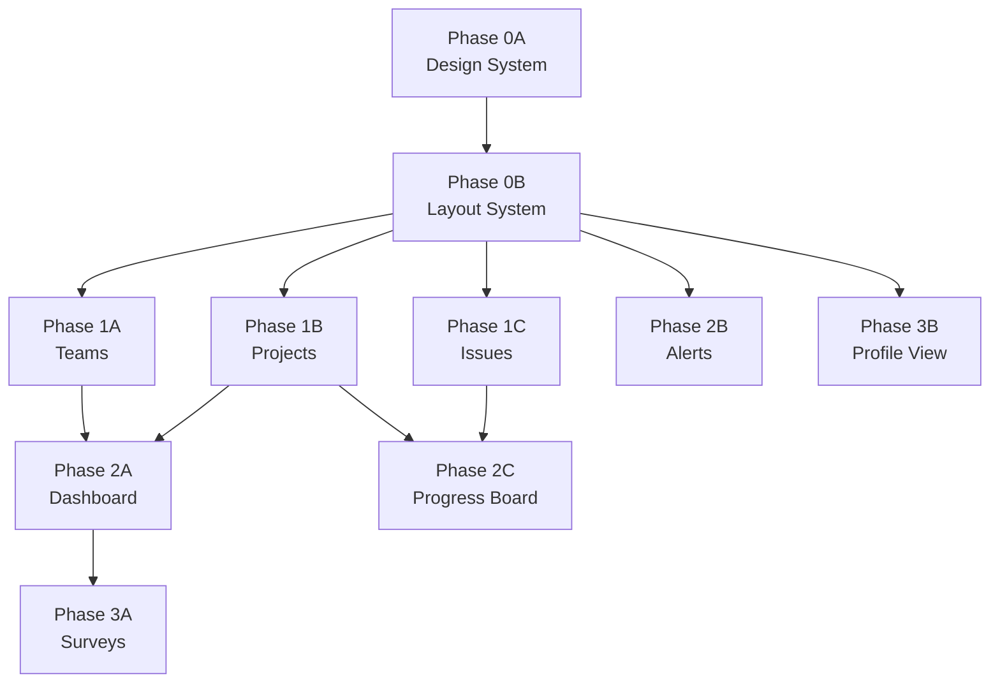

# フロントエンド実装プロンプト — 実行ガイド

AIエージェントがフロントエンド実装を進めるための実行プロンプト集です。

## 概要

| フェーズ | プロンプト | 内容 | 所要コンポーネント数 |
|---------|----------|------|-------------------|
| 0A | [phase-0a-design-system.md](phase-0a-design-system.md) | UIコンポーネント基盤 + Tailwind Config | 19 |
| 0B | [phase-0b-layout-system.md](phase-0b-layout-system.md) | AppLayout + Sidebar + Header | 8 |
| 1A | [phase-1a-teams.md](phase-1a-teams.md) | チーム一覧 + チーム詳細 | 8 + hooks |
| 1B | [phase-1b-projects.md](phase-1b-projects.md) | PJ一覧 + PJ詳細 | 10 + hooks |
| 1C | [phase-1c-issues.md](phase-1c-issues.md) | Issue作成 + Issue詳細 | 11 + hooks |
| 2A | [phase-2a-dashboard.md](phase-2a-dashboard.md) | ロール別ダッシュボード | 9 + hooks |
| 2B | [phase-2b-alerts.md](phase-2b-alerts.md) | アラート一覧 | 4 + hooks |
| 2C | [phase-2c-progress-board.md](phase-2c-progress-board.md) | カンバン + ガント統合 | 7 |
| 3A | [phase-3a-surveys.md](phase-3a-surveys.md) | サーベイ回答 + 設定 | 5 + hooks |
| 3B | [phase-3b-profile-view.md](phase-3b-profile-view.md) | プロフィール閲覧 | 4 + hooks |

## API ギャップ確認（実装前に必読）

各フェーズの実装を始める前に、必ず [frontend-api-gap-backlog.md](frontend-api-gap-backlog.md) を確認してください。

- **✅ Ready** なフェーズはそのまま実装を開始できます
- **⚠️ Partial** なフェーズは、不足しているAPIエンドポイントをモック or 先にAPI実装する必要があります
- **❌ Not Ready** なフェーズは、API実装が完了するまで着手できません

| フェーズ | APIブロッカー状況 |
|---------|------------------|
| 0A | ✅ Ready — API不要 |
| 0B | ✅ Ready — 認証エンドポイントのみ（実装済み）|
| 1A | ⚠️ Partial — `member-workloads`, `condition-summary` 未実装 |
| 1B | ⚠️ Partial — チーム解除 DELETE 未実装、レスポンス項目不足 |
| 1C | ✅ Ready — 全エンドポイント実装済み |
| 2A | ⚠️ Partial — グローバルalerts, my issues, pending surveys, condition 未実装 |
| 2B | ⚠️ Partial — グローバル `GET /alerts`, reopen 未実装 |
| 2C | ✅ Ready — 既存エンドポイントで対応可能 |
| 3A | ⚠️ Partial — pending surveys フィルター未実装 |
| 3B | ❌ Not Ready — プロフィール閲覧/編集エンドポイント未実装 |

> 詳細: [frontend-api-gap-backlog.md](frontend-api-gap-backlog.md)

## 依存関係と実行順序



### 実行ルール

1. **Phase 0 は直列:** 0A → 0B の順で実行する（0B は 0A のコンポーネントに依存）
2. **Phase 1 は並列可能:** 1A, 1B, 1C は同時に実行できる（相互依存なし）
3. **Phase 2 は Phase 1 完了後:** 2A は 1A+1B、2C は 1B+1C に依存。2B は 0B のみ依存で早期実行可能。
4. **Phase 3 は Phase 2 完了後:** 3A は 2A に依存。3B は 0B のみ依存で早期実行可能。

### 推奨実行スケジュール

```
Step 1: Phase 0A (Design System)
Step 2: Phase 0B (Layout System)
Step 3: Phase 1A + 1B + 1C (並列) + 2B (並列可)
Step 4: Phase 2A + 2C (並列) + 3B (並列可)
Step 5: Phase 3A
```

## 共通ルール（全フェーズ共通）

### 制御フレーズ

全プロンプトの冒頭に以下の制御フレーズがあります。エージェントはこのフレーズに従い:
1. 不明点を質問する
2. 実装計画を提示する
3. ユーザーの明示的な確認を得てから実装を開始する

### Source of Truth

| ドキュメント | 内容 |
|-------------|------|
| `docs/ui-specification.md` | UI全体の仕様（最優先） |
| `docs/ui-pages/*.md` | 個別ページ仕様 |
| `specs/business/*.md` | ビジネスロジック |
| `specs/api/openapi-design-reference.json` | APIスキーマ |
| `specs/ai-agents/guidelines.md` | AIエージェントガイドライン |

### コーディングパターン

| パターン | ルール |
|---------|--------|
| ページ | `pages/` は薄いラッパー、ロジックは `features/` に置く |
| データ取得 | SWR (`useSWR`)、キーはAPIパスと一致 |
| フォーム | react-hook-form + zod |
| mutation | ボタンスピナー + Toast (成功/失敗) + SWR再検証 |
| 楽観的更新 | カンバンDnD、DoDチェック、ステータス変更 |
| ページネーション | `?page=1&per_page=20`、URL同期 |
| localStorage | チーム選択、ガント/カンバン切替、グルーピング選択 |
| スタイル | Tailwind CSS + `cn()` ユーティリティ |
| export | named export（ページのみ default export） |
| 型定義 | props型は `コンポーネント名Props` |

### 受け入れ基準（共通）

全フェーズで以下を満たすこと:
- `pnpm typecheck` がエラーなく通る
- `pnpm lint` がエラーなく通る
- コンポーネントのpropsが `docs/ui-specification.md` と一致する
- 4状態（loading / empty / error / success）が実装されている

## 関連ドキュメント

- [UI仕様書](../../../../docs/ui-specification.md)
- [ページ仕様書](../../../../docs/ui-pages/README.md)
- [ライブラリ比較](../../../../docs/ui-references/library-comparison.md)
- [Frontend ↔ API ギャップ一覧](frontend-api-gap-backlog.md)
- [AIエージェントガイドライン](../../guidelines.md)
- [既存バックエンドプロンプト](../../spec-execution-prompts.md)
